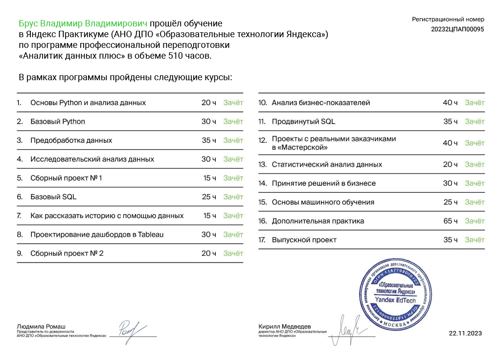

# ya_praktikum_da

Рекомендуется смотреть через [External viewer](https://nbviewer.org/github/vvbrus/ya_praktikum_da) 

## Описание:
В репозитории представлены проекты курса [Аналитик данных плюс](https://practicum.yandex.ru/data-analyst-plus/) (Яндекс Практикум).

## Основные инструменты и навыки, полученные при обучении:
- Языки: Python, SQL
- Предобработка данных 
- Анализ данных: библиотеки Pandas, Os, NumPy, SciPy, Math, Statsmodels, Datetime, IPython, Sklearn, Scipy, Itertools, Warnings, Phik
- Визуализация: Matplotlib, Plotly, Seaborn
- Построение дашбордов: Tableau Public, Yandex DataLens
- Метрики юнит-экономики, когортный анализ
- Работа с гипотезами
- A/B-теститрование
- Машинное обучение

## Сертификат об обучении:

## Проекты:
| №| Название и ссылка | О чем проект                                                     | Навыки и инструменты           |  
|-----------|-------------------|------------------------------------------------------------------|-----------------------------------|
|1              |[Исследование данных сервиса “Яндекс.Музыка” — сравнение пользователей двух городов](01_music_big_cities/)|Проверяем гипотезы о музыкальных предпочтениях пользователей Яндекс.Музыки в Москве и Санкт-Петербурге.|`Pandas`|
|2              |[Исследование надежности заемщиков](02_borrowers_reliability)|Анализируем профили клиентов банка с целью определить факторы, влияющие на возврат клиентом кредита в срок. Определяем долю кредитоспособных клиентов.|`Предобработка данных` `Pandas` `NumPy`|
|3              |[Исследование объявлений о продаже квартир](03_real_estate_sales)|Исследуем архив объявлений о продаже объектов недвижимости в Санкт-Петербурге и соседних населенных пунктах (поиск особенностей, закономерностей, распределений и аномалий).|`Pandas` `NumPy` `Matplotlib` `Предобработка данных` `Исследовательский анализ данных` `Визуализация данных`|
|4              |[Анализ рынка российского кинопроката](04_film_distribution_market)|Исследуем данные  о прокатных удостоверениях, сборах и государственной поддержке фильмов, а также информацию с сайта КиноПоиск. Выявляем текущие тренды|`Pandas` `NumPy` `Matplotlib` `Предобработка данных` `Исследовательский анализ данных` `Визуализация данных`|
|5              |[Базовый SQL](05_basic_SQL)|Анализируем рынок инвестиций. Работа с базой данных, которая хранит информацию о венчурных фондах и инвестициях в компании-стартапы.|`SQL` `PostgreSQL`|
|6              |[Исследование рынка общественного питания Москвы](06_catering_market)|Анализируем рынок общепита Москвы для инвесторов, ищем интересные особенности и презентуем полученные результаты, которые в будущем помогут в выборе подходящего инвесторам места для открытия заведения общественного питания в Москве.|`Pandas` `Numpy` `Matplotlib` `seaborn` `Plotly` `Folium` `Json` `MS Power Point` `Предобработка данных` `Исследовательский анализ данных` `Визуализация данных` `Создание презентации`| 
|7              |[Построение дашбордов в Tableau Public](07_ya_zen_cards)|Анализ взаимодействия пользователей с карточками Яндекс.Дзен|`SQL` `SQLAlchemy` `Tableau Public` `Построение дашбордов`|
|8              |[Исследование уровня потребительской лояльности NPS](08_NPS_telecom)|Определяем уровень потребительской лояльности, или NPS, среди клиентов из России для большой телекоммуникационной компании, оказывающей услуги на территории всего СНГ.|`Pandas` `SQL` `SQLAlchemy` `NumPy` `Tableau Public` `Построение дашбордов` `Продуктовые метрики`|
|9              |[Маркетинговое исследование развлекательного приложения](09_loss_analysis)|Анализируем продуктовые метрики и ищем причину убыточности приложения|`Pandas` `NumPy` `Matplotlib` `seaborn` `Plotly` `Datetime` `Предобработка данных` `Исследовательский анализ данных` `Визуализация данных` `Продуктовые метрики`|
|10             |[Продвинутый SQL](10_advanced_SQL)|Исследование базы данных сервиса Stackoverflow|`SQL` `PostgreSQL` `Pandas` `Matplotlib` `seaborn`|
|11             |[Исследование трафика такси](11_taxi_traffic)|Определить временные периоды, когда недостаточно водителей, т.е. наблюдается дефицит предложения|`Pandas` `Numpy` `Os` `Scipy` `Math` `Matplotlib` `Seaborn` `Datetime` `Предобработка данных` `Исследовательский анализ данных` `Визуализация данных` `Статистический анализ данных`|
|12             |[Проверка гипотез для увеличения выручки крупного интернет-магазина. Запуск A/B-теста](13_hypothesis_ab_test)|Приоритизируем гипотезы и анализируем результаты A/B-теста с помощью статистических методов|`Pandas` `Numpy` `Os` `Scipy` `Matplotlib` `Seaborn` `Datetime` `Предобработка данных` `Исследовательский анализ данных` `Визуализация данных` `Статистический анализ данных` `A/B-тестирование`|
|13             |[Исследование данных клиентов сети фитнес-центров и разработка стратегии по их удержанию. Машинное обучение](14_machine_learning)|Анализируем клиентские анкеты и на основе аналитических данных разрабатываем план действий по удержанию клиентов|`Pandas` `Numpy` `Os` `Scipy` `Matplotlib` `Seaborn` `IPython` `Sklearn ` `Itertools` `Warnings` `Предобработка данных` `Исследовательский анализ данных` `Визуализация данных` `Машинное обучение`|
|14             |[Исследование данных интернет-магазина видео-игр с целью планирования рекламных компаний. Проверка гипотез](15_video_game_store_hypothesis)|Анализируем исторические данные о продаже игр в поиске закономерностей|`Pandas` `Numpy` `Os` `Scipy` `Matplotlib` `Seaborn` `Sklearn ` `Phik` `Warnings` `Предобработка данных` `Исследовательский анализ данных` `Визуализация данных` `Статистический анализ данных`|
|15             |[Анализ оттока клиентов банка и их сегментация по количеству потребляемых продуктов. Проверка гипотез](16_1_bank_churn_rate_analysis)|Анализируем данные клиентов банка с целью их сегментации по количеству потребляемых продуктов, обращая особое внимание на отток|`Pandas` `Numpy` `Os` `Scipy` `Matplotlib` `Seaborn` `Requests` `Phik` `Math` `Itertools` `Предобработка данных` `Исследовательский анализ данных` `Визуализация данных` `Статистический анализ данных`|
|16             |[Проверка гипотез по влиянию новой рекомендательной системы на поведение пользователей интернет-магазина](16_2_ab_project_marketing_events)| Оцениваем корректность проведения A/B-теста и анализируем его результаты|`Pandas` `Seaborn` `Numpy` `Plotly` `Matplotlib` `Stats` `Проверка стат. гипотез`  `Событийная аналитика` `Продуктовые метрики`|
|17             |[Анализ сервиса для чтения книг по подписке](16_3_SQL_books)|Анализируем данные клиентов сервиса для чтения книг по подписке с использованием SQL-запросов к базе данных|`Pandas` `Numpy` `Matplotlib` `SQLAlchem` `SQL` `Предобработка данных` `Исследовательский анализ данных` `Визуализация данных`|
